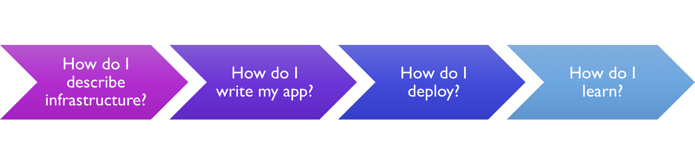
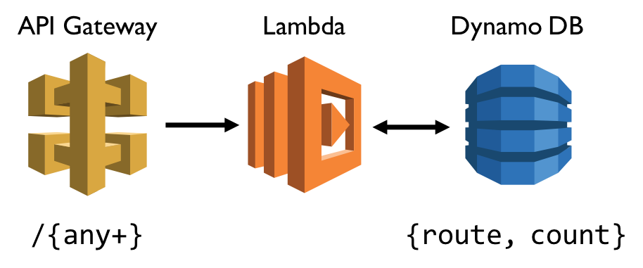

A few weeks ago, I presented the talk "Tooling in the Age of Serverless Computing" at Velocity San Jose. There was a lot of positive feedback and discussion after the talk, so I've decided to turn the talk into a blog post! You can view the video here [TBD] or download the [talk slides](https://cdn.oreillystatic.com/en/assets/1/event/270/Tooling%20in%20the%20age%20of%20serverless%20computing%20Presentation.pdf).

## The need for tools

Serverless is becoming more popular, and is leading to what some call "service-full" architectures. This idea actually pre-dates serverless platforms: instead of running your own Redis cluster, you use a managed cache service. Instead of running a database server on VMs, you use a database service. Serverless simply pushes this notion further: rather than keep a container active when it’s not processing requests, use a managed functions-as-a-service platform such as AWS Lambda, Azure Functions, or Google Cloud Functions.

While serverless dramatically simplifies applications and reduces the total cost of ownership, it does require new approaches and tools. Simplicity comes from managed services, which allow you to focus on your business problem instead of infrastructure. Complexity comes from the extra moving parts once you’re juggling dozens of services and hundreds of individual components. While managed services simplify your application, you must now control and understand each of them.

Service-full brings another shift as well: rather than have a dedicated ops team that deploys and manages infrastructure, application development teams are taking on this responsibility. This allows teams to be more agile and respond more quickly to changing business needs. Application developers now need to deeply understand the cloud, in order to leverage its benefits in application code.

There are a growing number of tools that address these challenges, making it easier for application developers to build and manage modern cloud applications. 

Sometimes, a tool is not the right solution: your team may have built up expertise in systems like CloudFormation and Azure Resource Manager. But, these services have a steep learning curve and can feel foreign to application developers. In this case, a tool can provide great benefits: it makes it easier to compose multiple services, while enforcing good DevOps practices. 

But, it can be challenging to choose the right tool for the job, since different tools often have very different approaches. This post presents a decision framework for evaluating tools and how you can use this framework to evaluate popular tools such as Serverless Framework, Terraform, Claudia.js, Up, AWS SAM, and Pulumi. 

## A decision framework

This framework consists of just 4 questions which help pinpoint the unique qualities of each tool. Then, you can evaluate which factors are most important for your team and your business problem.

Ask these questions:

1. How do I describe infrastructure?
2. How do I author my app?
3. How do I deploy my application?
4. How do I learn?



## Example app: route counter

Let's walk through some tools to see how we'd use this framework. It helps to consider a concrete application that you might implement in various tools. I've chosen an example that is simple but involves some logic and state: a serverless route counter. This is a REST API that counts the number of times a route has been hit. 

For example:

```bash
$curl $URL/wow
{"route":"wow","count":1}

$curl $URL/pulumi
{"route":"pulumi","count":1}

$curl $URL/wow
{"route":"wow","count":2}
```

We'll implement this app in different tools, but using the same architecture: AWS API Gateway, Lambda, and Dynamo DB:



The code for this example implemented with each tool is [available on GitHub](https://github.com/lindydonna/velocity-examples). 

## Serverless Framework

[Serverless Framework](https://serverless.com/) is one of the most widely-used tools for building serverless apps. Serverless provides a first-class experience for authoring serverless functions on AWS, Azure, GCP, and more. It manages both your code and your infrastructure, and atomically deploys everything together. You can author functions in JavaScript, Python, Java, and so on. There's also a rich ecosystem of community plugins that capture common patterns, such as adding a CloudFront distribution to a static website, or using webpack to reduce the size of Node.js functions.

The source for the route counter in Serverless Framework is available here: https://github.com/lindydonna/velocity-examples/tree/master/serverless. It comes out to 45 lines of code for the YAML configuration, mainly to set up Dynamo DB. Notice that Serverless provides a first-class experience for defining functions and APIs. For anything else, you can use CloudFormation syntax to manage resources.

The Lambda function itself is 30 lines of code in JavaScript, mainly because it has no error handling. (So don't use this in production!) Also, it implements "at most once" semantics for the count; if two functions run at exactly the same time, it's possible that they will both try to increment the same value. Another option would be to use [atomic counters on Dynamo DB](https://docs.aws.amazon.com/amazondynamodb/latest/developerguide/WorkingWithItems.html#WorkingWithItems.AtomicCounters).

### Serverless Framework evaluation

Now that we have a [sample app](https://github.com/lindydonna/velocity-examples/tree/master/serverless), let's answer our framework questions.

1. How do I describe infrastructure?

On AWS: when managing resources such as Lambda and API Gateway, there is first-class support and convenient syntax. For everything else, you can fall back to CloudFormation syntax.

2. How do I author my app?

There is no change to how the Lambda is authored (see [example](https://github.com/lindydonna/velocity-examples/blob/master/serverless/app.js)). You write a `(event, context, callback)` function, and can follow any AWS Lambda tutorial.

3. How do I deploy my application?

The `sls deploy` command deploys through AWS CloudFormation. So, CloudFormation tracks the state of what has already been deployed, and you can view all resources in the CloudFormation console.

4. How do I learn?

Serverless has a very active community, with lots of blogs and tutorials available. There's also an ecosystem of community plugins that solve common problems.

## Terraform

[Terraform](https://www.terraform.io/) is a very popular tool for defining cloud infrastructure. Terraform's goal is only to manage infrastructure, rather than application code. 

Terraform provides direct access to vendor APIs through HCL, Hashicorp Configuration Language. Terraform does not try to abstract these APIs in any way, so there's no special support for defining AWS API Gateway resources, for instance. This may be the reason why Terraform is not widely used for serverless scenarios, despite its popularity as an infrastructure-as-code tool.

So, it is much more verbose to define the infrastructure for the route counter, as compared to Serverless Framework. The [Terraform example](https://github.com/lindydonna/velocity-examples/tree/master/terraform) is about 150 lines of configuration, and requires setting up an API Gateway stage, deployment, and proxy methods. 

The Lambda code is identical to the Serverless Framework example, as Terraform does not change the way that applications are built.

### Terraform evaluation

With our [sample app](https://github.com/lindydonna/velocity-examples/tree/master/terraform), let's answer our framework questions for Terraform.

1. How do I describe infrastructure?

Use HCL to configure any cloud resource on virtually any cloud provider. You can also author your own provider.

2. How do I author my app?

There is no change to how Lambda functions are authored.

3. How do I deploy my application?

Terraform uses vendor APIs directly to provision cloud infrastructure, and does not rely on a central service from the cloud vendor. So, there is no service that tracks the state of cloud resources. Instead, this is placed in a state file. In the free version of Terraform, you must manage this statefile yourself, such as in an S3 bucket.

4. How do I learn?

There are lots of books and blog articles on Terraform in general, but little information on using Terraform for serverless scenarios. For instance, I found it hard to find information on how to set up Lambda log groups correctly. 

## Claudia.js

[Claudia.js](https://claudiajs.com/) is an opinionated framework geared toward JavaScript developers. It automates all the error-prone deployment and configuration tasks, and sets everything up the way JavaScript developers expect.

Claudia.js aims to have a very scoped tool that provides a great experience for its scenarios. So, Claudia supports JavaScript on AWS only. It's a great tool for developers who have built web applications but are new to AWS. Claudia automatically configures CORS, sets up a simple request/response format, and so on. With the API builder feature, you can configure API Gateway using regular JavaScript web server syntax. No need to create a Swagger spec!

Claudia manages only API Gateway and Lambda resources. For anything else, you should use a separate tool, such as CloudFormation.

Because Claudia is a streamlined framework, there is very little configuration required for [this example](https://github.com/lindydonna/velocity-examples/tree/master/claudia). There are only 18 lines of code needed, as Claudia automatically configures API Gateway for you. 

If you use Claudia's API builder, there's a much easier syntax for building the Lambda function. Rather than using a configuration file to specify that all requests should be proxied to the Lambda, you simply use the syntax `api.get('/{proxy+}', function (request)`. The code is easier to understand and has less of a learning curve compared with authoring a Lambda directly. The [app code](https://github.com/lindydonna/velocity-examples/blob/master/claudia/index.js) is a bit longer (39 lines of code), but is very readable.

### Claudia.js evaluation

1. How do I describe infrastructure?

For API Gateway and Lambda, use JSON files. For any other resources (such as Dynamo DB in this example), use a different tool, such as the AWS CLI or CloudFormation.

2. How do I author my app?

Use API builder for a convenient syntax that is familiar to Node.js developers.

3. How do I deploy my application?

Claudia.js uses AWS APIs directly, rather than going through CloudFormation. As such, there's a JSON state file that you must manage yourself.

4. How do I learn?

Claudia has a lot of tutorials and examples, and there's a upcoming book that will be published later this year.

## Up

[Up](https://up.docs.apex.sh/#introduction) is a tool that makes it easy to define serverless REST APIs. Up has built-in support for Node.js, Go, Python, Java, and more. It is built to be platform-agnostic, but currently supports only AWS.

Since Up does not currently manage Dynamo DB resources, that part of the application must be managed through CloudFormation or the AWS CLI. In [this example](https://github.com/lindydonna/velocity-examples/tree/master/up), the rest of the infrastructure is described in 23 lines of JSON.

Up takes a different approach to application code: rather than programming to Lambda directly, you can use a web framework such as Express.js. This makes it easy to port existing applications and provides a familiar experience. Check out the [implementation of the Lambda](https://github.com/lindydonna/velocity-examples/blob/master/up/app.js).

One unique aspect of Up, compared to all the other tools in this post, is that there's a great local development experience. It's very easy to run the application locally and connect to cloud resources, such as the Dynamo DB table.

### Up evaluation

Using the [Up sample app](https://github.com/lindydonna/velocity-examples/tree/master/up), let's answer the framework questions for Up.

1. How do I describe infrastructure?

For API Gateway and Lambda functions, author a simple JSON file. For everything else, use another tool such as CloudFormation. (There's a [feature request](https://github.com/apex/up/issues/218) for supporting custom CloudFormation.)

2. How do I author my app?

Use a regular web framework, such as Express.js, Koa, Django, and so on.

3. How do I deploy my application?

The command `up` deploys applications using CloudFormation. You can view all resources in the CloudFormation console.

4. How do I learn?

Up has great examples and tutorials, and a growing community.

## AWS Serverless Application Model (SAM)

The [AWS Serverless Application Model](https://github.com/awslabs/serverless-application-model) provides a simpler syntax for authoring serverless applications on AWS. SAM templates are translated to CloudFormation, so it is essentially a template layer on top of CloudFormation.

SAM is now open-source and accepts community contributions.

### AWS SAM evaluation

1. How do I describe infrastructure?

Use YAML or JSON, with a simpler syntax compared to regular CloudFormation.

2. How do I author my app?

There is no change to how Lambda functions are authored.

3. How do I deploy my application?

Use the SAM CLI, which deploys through CloudFormation.

4. How do I learn?

There are number of tutorials, documentation, as well as a SAM Slack channel.

## Pulumi

With Pulumi, you can create containers, serverless functions, and cloud infrastructure, with all the benefits of immutable infrastructure, and real programming languages. Pulumi takes a novel approach to cloud infrastructure: rather than authoring cloud configuration in YAML, you can use JavaScript, Python or Go. This makes it easy to build reusable components: rather than copying and pasting example code, you can just use an NPM package!

With Pulumi, you can author function and container code in any language that's supported by the cloud vendor. Pulumi lets you manage any cloud resource, ranging from low-level infrastructure, to containers and serverless functions. You can deploy to AWS, Azure, GCP, or Kubernetes.

Since Pulumi provide a code-oriented approach, it's very easy to build multiple levels of abstraction. So, we can implement the route counter example in 4 different ways. If we need full control over the infrastructure, and don't want to use any higher-level convenience layers, we can use the [`@pulumi/aws`](https://pulumi.io/reference/pkg/nodejs/@pulumi/aws/index.html) package. To simplify the infrastructure, we can instead use [`@pulumi/aws-severless`](https://pulumi.io/reference/pkg/nodejs/@pulumi/aws-serverless/index.html), which makes it easy to author Lambdas that are triggered from AWS events. And, for a very high-level API that can be ported to other cloud platforms, we can use the[`@pulumi/cloud`](https://pulumi.io/reference/pkg/nodejs/@pulumi/cloud/index.html) package. You can even author your own library that captures common patterns for you and your team.

### Low-level Pulumi example

We can build the route counter application by directly using the low-level [`@pulumi/aws`](https://pulumi.io/reference/pkg/nodejs/@pulumi/aws/index.html) package. Here, we'll specify all the the configuration properties of API Gateway, and build up a Swagger spec.

The ["raw" serverless version of the app](https://github.com/lindydonna/velocity-examples/tree/master/pulumi/pulumi-raw-serverless) comes out to 110 lines of code for the configuration, with the same 30 line Lambda implementation. 

### Using aws-serverless

In the raw serverless example, most of the infrastructure code is for configuring API Gateway, which involves a lot of boilerplate. The Pulumi team has factored this boilerplate into the library [`@pulumi/aws-severless`](https://pulumi.io/reference/pkg/nodejs/@pulumi/aws-serverless/index.html), which makes it much easier to define API Gateway resources.

Using `aws-serverless`, we have two options for building the app. We can either keep the Lambda implementation in a separate file, separate from the infrastructure definitions, or we can combine the two. In this example, both the infrastructure and app code are written in JavaScript, so it is natural to combine them.

If we [define the code in a separate file](https://github.com/lindydonna/velocity-examples/tree/master/pulumi/pulumi-serverless), we create a Lambda explicitly, by pointing it to a directory containing the app code:

```javascript
const lambda = new aws.lambda.Function("myfunction", {
    code: new pulumi.asset.FileArchive("./app"),
    ...
}
```

This version of the code is a mere 54 lines of code for configuration.

But, we can simplify even further! The `aws-serverless` provides default roles for the Lambda execution, which can simplify our infrastructure definition. We can also [define the Lambda inline](https://github.com/lindydonna/velocity-examples/tree/master/pulumi/pulumi-inline-lambda), which means the body of the Lambda can directly refer to the Dynamo table:

```javascript
const table = new aws.dynamodb.Table("counterTable", { ... });

const getHandler = async (event) => {
    ...
    const tableName = table.name.get();
    ...
}
```

Then, we can specify that the handler for the GET method should be the function we just defined:

```javascript
const api = new serverless.apigateway.API("api", {
    routes: [
        { method: "GET", path: "/{route+}", handler: getHandler }
    ]
});
```

Now, we have only 52 lines of code for both the infrastructure _and_ the app code!

### Using @pulumi/cloud

But wait, there's more! What if we want an even higher-level programming model, with a more natural way to combine infrastructure and runtime code? We can use the [`@pulumi/cloud`](https://pulumi.io/reference/pkg/nodejs/@pulumi/cloud/index.html) library, for a vendor-agnostic serverless and container experience. This library provides a more streamlined experience for authoring serverless functions that is more natural to application developers. Also, since your code does not directly reference any AWS-specific details, it's possible to deploy the same code to another cloud. (Currently, you can only target AWS with `@pulumi/cloud`, but we are hard at work on the [Azure implementation](https://github.com/pulumi/pulumi-azure/issues/61).)

Now, the code is even simpler, and captures only the essence of the problem we're solving. In [just 24 lines of code](https://github.com/lindydonna/velocity-examples/blob/master/pulumi/pulumi-cloud/index.js), we've defined both the infrastructure and the application code:

```javascript
const cloud = require("@pulumi/cloud-aws");

// Create a mapping from 'route' to a count
let counterTable = new cloud.Table("counterTable", "route");

// Create an API endpoint
let endpoint = new cloud.HttpEndpoint("hello-world");

endpoint.get("/{route+}", (req, res) => {
    let route = req.params["route"];
    console.log(`Getting count for '${route}'`);

    // get previous value and increment
    // reference outer `counterTable` object
    counterTable.get({ route }).then(value => { 
        let count = (value && value.count) || 0;
        counterTable.insert({ route, count: ++count }).then(() => {
            res.status(200).json({ route, count });
            console.log(`Got count ${count} for '${route}'`);    
        });
    });
});

exports.endpoint = endpoint.publish().url;
```

Now, you may decide that building a route counter API is an important business problem that you want to solve for the serverless community. You could build your own library that encapsulates this functionality, and provide an API for your users that is even simpler:

```javascript
const routeCounter = require("my-awesome-route-counter");
let endpoint = routeCounter.createEndpoint("counter");
exports.endpoint = endpoint.url;
```

When a user runs this code through the Pulumi CLI, it will provision all necessary cloud resources, including the Dynamo Table, API Gateway, and Lambda function. Not bad for 3 lines of code.

### Pulumi evaluation

Now that we have 4 Pulumi examples to consider, let's evaluate Pulumi.

1. How do I describe infrastructure?

Use JavaScript, Python, or Go to describe infrastructure that targets AWS, Azure, GCP, or Kubernetes. Pulumi provides first-class support for serverless functions and [containers](http://blog.pulumi.com/deploying-production-ready-containers-with-pulumi).

2. How do I author my app?

There are a few options: you can target AWS Lambda directly, using either the `@pulumi/aws` or `@pulumi/aws-serverless` libraries. Or, you can use the higher-level `@pulumi/cloud` library for a more convenient syntax for defining REST APIs and Lambda functions triggered on various events.

3. How do I deploy my application?

Deploy using the `pulumi update` command. Pulumi uses vendor APIs directly, rather than targeting CloudFormation as an intermediate layer. The resources you've provisioned in a stack are tracked on pulumi.com, where you can see the full details of each resource and its properties.

4. How do I learn?

There are many ways to learn more about Pulumi! 

- This blog! 
- Tutorials on [pulumi.io](https://pulumi.io/quickstart/), which cover a number of end-to-end scenarios. 
- The weekly [YouTube webcast](https://www.youtube.com/channel/UC2Dhyn4Ev52YSbcpfnfP0Mw), featuring Pulumi CTO Luke Hoban. 
- Our [Slack channel](https://slack.pulumi.io) is a great place to ask questions or learn how to contribute to Pulumi. 
- On [GitHub](https://github.com/pulumi/pulumi). Pulumi is open-source, so feel free to dig into the source or open issues for feature requests.

I hope this post has helped you make sense out of all the serverless tooling options available. No matter which option you choose, make sure to use a solution that provides repeatable deployments and follows the principles of immutable infrastructure. Happy deploying!


